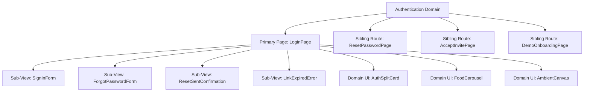

# SnackBot Cloud POS — Directory Architecture Revision Plan

> **Generated:** 2026-09-04  
> **Purpose:** Blueprint for restructuring `src/` from a flat 26-file directory into a scalable, domain-driven feature architecture.  
> **Status:** Active (Phase 1: Authentication & Onboarding Focus)

---

## 1. Architectural Motivation & Current Bottlenecks

### Current State
Currently, all 26 application components reside in a single flat directory: `src/components/`.

```
src/
├── components/
│   ├── Login.tsx            (~787 lines — contains Login, ResetPassword, 4 views, carousel, canvas)
│   ├── Reports.tsx          (2,808 lines — monolithic reporting suite)
│   ├── Settings.tsx         (1,680 lines — monolithic settings)
│   ├── MenuManagement.tsx   (1,195 lines — categories, items, modifiers, badges)
│   ├── Dashboard.tsx        (1,034 lines — KPI stat cards, charts, alerts, staff snapshot)
│   └── ... 21 other flat files
```

### Challenges
1. **Mixed Responsibilities**: Top-level route pages, sub-views, modal dialogs, and reusable micro-widgets are indistinguishable at the folder level.
2. **Maintenance Risk**: Editing a sub-view (e.g. password recovery or a chart) requires modifying monolithic 1,000–2,800+ line files.
3. **No Clear Hierarchy**: Difficult to trace which components are **Primary Entry Points (Pages)** vs. **Sub-Pages / Sub-Views** vs. **Shared UI Components**.

---

## 2. Classification Taxonomy: Primary vs. Sub-Page

To make the codebase intuitive and manageable, every screen unit is classified into one of three tiers:

| Tier | Definition | Examples |
|---|---|---|
| **Tier 1: Primary Page (Route Entry)** | Top-level screen mounted by URL routing or primary navigation sidebar. Responsible for high-level state, layout wrapper, and route-level guards. | `LoginPage`, `DashboardPage`, `ReportsPage` |
| **Tier 2: Sub-Page / View Mode** | Nested screens, distinct multi-step flows, or standalone route variants that belong to the same functional domain. | `ResetPasswordView`, `SignInForm`, `ForgotForm`, `SalesRevenueView` |
| **Tier 3: Domain Components & Widgets** | Specialized UI blocks specific to that feature (e.g. carousels, stat cards, filters). | `FoodCarousel`, `AmbientCanvas`, `AuthSplitCard` |

---

## 3. Focus: Login & Authentication Domain (Phase 1)

### 3.1 Domain Breakdown

Currently, [src/components/Login.tsx](file:///c:/Projects/snackbot/Cloud/src/components/Login.tsx) (~787 lines) handles 5 distinct visual states, a standalone secondary route (`ResetPassword`), animated canvas backgrounds, and an auto-cycling 3-image carousel.



### 3.2 Identification Matrix (Login Domain)

| Name | Classification | Role & Current Location |
|---|---|---|
| **`LoginPage`** | **PRIMARY PAGE** | The root authentication portal mounted when `!user`. Manages overall auth state, credentials submission, and session establishment. |
| **`SignInForm`** | **Sub-View** | The credential input form (`email` + `password` + show/hide toggle + submit action). |
| **`ForgotPasswordForm`** | **Sub-View** | Password reset request form triggering `supabase.auth.resetPasswordForEmail`. |
| **`ResetSentView`** | **Sub-View** | Post-submission feedback view confirming email delivery with 24-hour expiry note. |
| **`LinkExpiredView`** | **Sub-View** | Error handler screen parsing `#error=access_denied&error_code=otp_expired` from Supabase URL hash. |
| **`ResetPasswordPage`** | **Primary Sub-Route** | Standalone route (`/reset-password`) loaded when staff clicks their reset email link. Validates password strength (8+ chars) and confirmation match. |
| **`AcceptInvitePage`** | **Primary Sub-Route** | Staff onboarding route (`/accept-invite?token=...`) validating 24-hour tenant invitation tokens. |
| **`DemoOnboardingPage`** | **Primary Sub-Route** | Instant sandbox trial route (`/demo-onboarding`) allowing users to experience the POS without credentials. |
| **`FoodCarousel`** | **Feature Component** | 3-image cross-fading restaurant showcase (pasta, wagyu steak, cafe latte art) with telemetry tags and auto-sliding timer (4s). |
| **`AmbientCanvas`** | **Feature Component** | 6-layer animated atmosphere: Pure Espresso Noir base, candlelight orbs (`#C28E38`), spotlight sweeps, and grain overlay. |
| **`AuthInputs`** | **Micro-Components** | `SplitInput`, `PrimaryButton`, `FormField`, `InlineError`, `PasswordCheck`. |

---

## 4. Proposed Directory Structure for Auth Domain

```
src/
├── features/
│   └── auth/
│       ├── index.ts                      <-- Clean public API (exports LoginPage, ResetPasswordPage, etc.)
│       │
│       ├── pages/                        <-- Tier 1: Primary Pages & Routes
│       │   ├── LoginPage.tsx             <-- Main Login container (orchestrates layout & sub-views)
│       │   ├── ResetPasswordPage.tsx     <-- /reset-password route component
│       │   ├── AcceptInvitePage.tsx      <-- /accept-invite route component
│       │   └── DemoOnboardingPage.tsx    <-- /demo-onboarding route component
│       │
│       ├── views/                        <-- Tier 2: Sub-Pages & View States
│       │   ├── SignInForm.tsx            <-- Welcome Back! email/password form
│       │   ├── ForgotPasswordForm.tsx    <-- Reset link request form
│       │   ├── ResetSentView.tsx         <-- "Check Your Email" confirmation screen
│       │   └── LinkExpiredView.tsx       <-- "Link Expired" hash-error screen
│       │
│       ├── components/                   <-- Tier 3: Feature-Specific UI
│       │   ├── AuthSplitCard.tsx         <-- Dual-column rounded floating card container
│       │   ├── FoodCarousel.tsx          <-- 3-image auto-advance carousel with captions & dots
│       │   ├── AmbientCanvas.tsx         <-- Espresso Noir backdrop, candlelight orbs & sweeps
│       │   └── BrandBadge.tsx            <-- #29221D coffee bean chip with #D97706 gold icon
│       │
│       ├── hooks/                        <-- Business Logic & State
│       │   ├── useAuthFlow.ts            <-- signInWithPassword & audit logger
│       │   ├── usePasswordReset.ts       <-- resetPasswordForEmail & updateUser handlers
│       │   └── useCarousel.ts            <-- Slide index & setInterval timer mechanics
│       │
│       ├── utils/                        <-- Helpers & Validators
│       │   ├── parseHashError.ts         <-- URL hash parser (#error_code=otp_expired)
│       │   └── authValidators.ts         <-- Password length & match validation
│       │
│       └── types/                        <-- Domain Types
│           └── auth.types.ts             <-- LoggedInUser, View types, Slide item types
```

---

## 5. Benefits of this Modularization

1. **Isolation of Concerns**:
   - Visual tweaks to the food showcase or background beams only touch `FoodCarousel.tsx` or `AmbientCanvas.tsx`.
   - Modifying authentication logic or error messages only touches `useAuthFlow.ts` or `SignInForm.tsx`.
2. **Reusability**:
   - `ResetPasswordPage` and `AcceptInvitePage` share standard `SplitInput` and `PrimaryButton` components without duplication.
3. **Zero Regressions**:
   - By creating a barrel file (`src/features/auth/index.ts`), `src/App.tsx` can import everything cleanly:
     ```tsx
     import { LoginPage, ResetPasswordPage, AcceptInvitePage, DemoOnboardingPage } from './features/auth';
     ```
   - Existing code remains 100% backward compatible during phased transition.

---

---

## 6. Next Steps: Full Application Domain Breakdown

Following the successful classification of the Login domain, below is the detailed architecture and directory restructuring plan for all remaining application domains.

---

### 6.1 Domain 2: Sales & Financial Reports (`src/features/reports/`)

Currently, [src/components/Reports.tsx](file:///c:/Projects/snackbot/Cloud/src/components/Reports.tsx) is a monolithic **2,808-line file** containing 8 complex reporting sections, multi-filters, and CSV export engines.

#### Classification Matrix
| Component / View | Tier Classification | Role & Features |
|---|---|---|
| **`ReportsPage`** | **PRIMARY PAGE** | Top-level entry mounted by sidebar tab `'reports'`. Orchestrates sub-navigation tabs, date preset bar, and data refetching. |
| **`SalesRevenueView`** | **Sub-Page** | Gross/Net revenue breakdown, tax, discounts, refunds, hourly heatmap charts. |
| **`MenuInsightsView`** | **Sub-Page** | Category revenue share, top 10 bestsellers, worst performers, margins. |
| **`PaymentTransactionsView`** | **Sub-Page** | Distribution by tender (Cash, Credit/Debit Card, DuitNow QR, TnG, GrabPay). |
| **`TableCustomerView`** | **Sub-Page** | Table occupancy, average party size, turnover duration. |
| **`StaffPerformanceView`** | **Sub-Page** | Waiter/cashier order count, revenue generation, tip/shift stats. |
| **`StockMovementView`** | **Sub-Page** | Inventory stock deductions and movement correlation with orders. |
| **`EODReportsView`** | **Sub-Page** | End-of-Day register closure snapshots and cash drawer balancing. |
| **`SessionReportsView`** | **Sub-Page** | Individual shift register sessions and discrepancy logs. |
| **`ReportFiltersSidebar`** | **Feature Component** | Multi-attribute filtering (order types, payment methods, categories, items). |
| **`DateRangePicker`** | **Feature Component** | Quick presets (Today, Yesterday, 7D, 30D, Custom). |
| **`CsvExportButton`** | **Feature Component** | Client-side spreadsheet export with column formatting. |

#### Proposed Directory Layout:
```
src/features/reports/
├── index.ts
├── pages/
│   └── ReportsPage.tsx                   <-- Primary Page
├── views/                                <-- 8 Sub-Pages
│   ├── SalesRevenueView.tsx
│   ├── MenuInsightsView.tsx
│   ├── PaymentTransactionsView.tsx
│   ├── TableCustomerView.tsx
│   ├── StaffPerformanceView.tsx
│   ├── StockMovementView.tsx
│   ├── EODReportsView.tsx
│   └── SessionReportsView.tsx
├── components/
│   ├── ReportFiltersSidebar.tsx
│   ├── DateRangePicker.tsx
│   ├── ReportKpiCards.tsx
│   └── CsvExportButton.tsx
├── hooks/
│   ├── useReportData.ts                  <-- Unified data loader & aggregation
│   └── useCsvExport.ts                   <-- CSV generator logic
└── types/
    └── reports.types.ts
```

---

### 6.2 Domain 3: Menu & Catalog Management (`src/features/menu/`)

Currently, [src/components/MenuManagement.tsx](file:///c:/Projects/snackbot/Cloud/src/components/MenuManagement.tsx) is a **1,938-line file** managing items, category hierarchies, modifier groups, and AI recipes.

#### Classification Matrix
| Component / View | Tier Classification | Role & Features |
|---|---|---|
| **`MenuManagementPage`** | **PRIMARY PAGE** | Top-level entry mounted by sidebar tab `'menu'`. Manages active catalog sub-tab and live search. |
| **`MenuItemsView`** | **Sub-Page** | Grid/table list of dishes, pricing, tax overrides, availability toggles. |
| **`CategoriesView`** | **Sub-Page** | Category tree, sorting, and visibility settings. |
| **`ModifiersView`** | **Sub-Page** | Variant groups, addon lists, single vs. multi-select rules. |
| **`AvailabilitySchedulesView`**| **Sub-Page** | Day-of-week and time-slot availability rules (Breakfast vs. Dinner). |
| **`ItemEditorModal`** | **Sub-Component** | Modal for creating/updating items, image upload, tax override. |
| **`ModifierGroupModal`** | **Sub-Component** | Modal for configuring add-on options and price adjustments. |
| **`CsvImportDrawer`** | **Sub-Component** | Bulk CSV catalog import tool. |
| **`AiRecipeAssistant`** | **Sub-Component** | Gemini AI tool for ingredient ideas and item descriptions. |

#### Proposed Directory Layout:
```
src/features/menu/
├── index.ts
├── pages/
│   └── MenuManagementPage.tsx            <-- Primary Page
├── views/                                <-- 4 Sub-Pages
│   ├── MenuItemsView.tsx
│   ├── CategoriesView.tsx
│   ├── ModifiersView.tsx
│   └── AvailabilitySchedulesView.tsx
├── components/
│   ├── ItemEditorModal.tsx
│   ├── CategoryModal.tsx
│   ├── ModifierGroupModal.tsx
│   ├── CsvImportDrawer.tsx
│   └── AiRecipeAssistant.tsx
├── hooks/
│   ├── useMenuCatalog.ts                 <-- Supabase queries with merchant cache
│   └── useImageUpload.ts                 <-- Storage bucket upload handler
└── types/
    └── menu.types.ts
```

---

### 6.3 Domain 4: Master Settings Panel (`src/features/settings/`)

Currently, [src/components/Settings.tsx](file:///c:/Projects/snackbot/Cloud/src/components/Settings.tsx) is **3,241 lines** (the largest single file in the codebase), holding 15 granular configuration sections inside one file.

#### Classification Matrix
| Component / View | Tier Classification | Role & Features |
|---|---|---|
| **`SettingsPage`** | **PRIMARY PAGE** | Top-level entry mounted by sidebar tab `'settings'`. Provides search bar, section navigation, and dnd-kit ordering. |
| **15 Section Panels** | **Sub-Pages / Panels** | Each section isolated into its own component: |
| - `GeneralSection` | Sub-Panel | Business name, currency, timezone, receipt headers/footers. |
| - `BranchSection` | Sub-Panel | Outlet setup, branch codes, active locations. |
| - `PosDevicesSection` | Sub-Panel | Terminal registration and pairing codes. |
| - `UsersRolesSection` | Sub-Panel | Role permissions, staff PINs. |
| - `PaymentSection` | Sub-Panel | Gateway toggles, rounding rules, split bills. |
| - `TaxComplianceSection` | Sub-Panel | SST rates, LHDN credentials. |
| - `MenuBehaviourSection`| Sub-Panel | Stock rules, price overrides. |
| - `TableSection` | Sub-Panel | Table transfer/merge, QR rules. |
| - `InventorySection` | Sub-Panel | Auto-deductions, low-stock threshold defaults. |
| - `DashboardSection` | Sub-Panel | Analytics preferences and default ranges. |
| - `NotificationSection`| Sub-Panel | Warning thresholds, email schedules. |
| - `CloudSyncSection` | Sub-Panel | Sync interval, offline fallback mode. |
| - `LoyaltySection` | Sub-Panel | Points earning ratios, redemption rules. |
| - `SecuritySection` | Sub-Panel | 2FA, session expiry, audit logs. |
| - `AppearanceSection` | Sub-Panel | Theme presets (Light/Dark/System), color accents. |

#### Proposed Directory Layout:
```
src/features/settings/
├── index.ts
├── pages/
│   └── SettingsPage.tsx                  <-- Primary Page (Hosts layout & search)
├── sections/                             <-- 15 Isolated Setting Panels
│   ├── GeneralSection.tsx
│   ├── BranchSection.tsx
│   ├── PosDevicesSection.tsx
│   ├── UsersRolesSection.tsx
│   ├── PaymentSection.tsx
│   ├── TaxComplianceSection.tsx
│   ├── MenuBehaviourSection.tsx
│   ├── TableSection.tsx
│   ├── InventorySection.tsx
│   ├── DashboardSection.tsx
│   ├── NotificationSection.tsx
│   ├── CloudSyncSection.tsx
│   ├── LoyaltySection.tsx
│   ├── SecuritySection.tsx
│   └── AppearanceSection.tsx
├── components/
│   ├── SettingRow.tsx                    <-- Reusable setting item with toggle/input
│   ├── SettingSectionCard.tsx            <-- Collapsible card container
│   └── SettingSearchInput.tsx            <-- Deep section search bar
└── hooks/
    └── useSettingsSync.ts                <-- Local state + Supabase upsert debounce
```

---

### 6.4 Domain 5: Operations & Inventory (`src/features/operations/`)

Currently grouped loosely as separate files: `Dashboard.tsx` (1,034 lines), `Inventory.tsx` (902 lines), `QRManagement.tsx` (112 KB), `CloudSync.tsx`, and `BranchesList.tsx`.

#### Classification Matrix
| Component / View | Tier Classification | Role & Features |
|---|---|---|
| **`DashboardPage`** | **PRIMARY PAGE** | Operational hub: real-time revenue cards, active tables, kitchen bottlenecks, staff snapshot. |
| **`InventoryPage`** | **PRIMARY PAGE** | Stock tracking, ingredient depletion, min-alert levels, AI restock forecast. |
| **`QRManagementPage`** | **PRIMARY PAGE** | Dine-in tables, room layouts, and printable QR code cards. |
| **`BranchManagementPage`**| **PRIMARY PAGE** | Multi-outlet overview and switcher. |
| **`CloudSyncPage`** | **PRIMARY PAGE** | Sync status, queue health, conflict resolution. |
| **`TableLayoutEditor`** | **Sub-Component** | Visual drag-and-drop table layout canvas. |
| **`QrCodeGenerator`** | **Sub-Component** | Individual & bulk table QR code export for print. |
| **`StockAdjustmentModal`**| **Sub-Component** | Quick manual stock increment/decrement modal. |

#### Proposed Directory Layout:
```
src/features/operations/
├── index.ts
├── dashboard/
│   ├── DashboardPage.tsx                 <-- Primary Page
│   └── components/                       <-- StatCards, ChartSection, AlertBanner
├── inventory/
│   ├── InventoryPage.tsx                 <-- Primary Page
│   └── components/                       <-- StockTable, StockFilterTabs, RestockModal
├── tables-qr/
│   ├── QRManagementPage.tsx              <-- Primary Page
│   └── components/                       <-- TableGrid, QrCardModal, LayoutEditor
└── sync/
    └── CloudSyncPage.tsx                 <-- Primary Page
```

---

### 6.5 Domain 6: Compliance, Tax & Audit (`src/features/compliance/`)

Currently: `LHDN.tsx` (1,118 lines), `TaxManagement.tsx`, and `AuditLogs.tsx`.

#### Classification Matrix
| Component / View | Tier Classification | Role & Features |
|---|---|---|
| **`LHDNPage`** | **PRIMARY PAGE** | E-invoice compliance hub: pending orders, batching, submitted validations. |
| **`LHDNPendingView`** | **Sub-Page** | Unbatched completed orders pending consolidation. |
| **`LHDNBatchesView`** | **Sub-Page** | Batch groupings per branch ready for submission. |
| **`LHDNSubmittedView`** | **Sub-Page** | Validated invoices with tax authority UUIDs. |
| **`LHDNErrorsView`** | **Sub-Page** | Rejection diagnostics and retry workflows. |
| **`TaxManagementPage`** | **PRIMARY PAGE** | Service tax, SST configuration, tax grouping. |
| **`AuditLogsPage`** | **PRIMARY PAGE** | Immutable security trail and staff actions. |

---

### 6.6 Domain 7: Customer Dine-In Ordering (`src/features/ordering/`)

Currently: `Tableorderpage.tsx` (customer-facing QR ordering screen).

#### Classification Matrix
| Component / View | Tier Classification | Role & Features |
|---|---|---|
| **`TableOrderPage`** | **PRIMARY PAGE** | Mobile-optimized self-ordering menu for dine-in guests (`/order`). |
| **`QrRedirect`** | **Route Dispatcher** | Resolves `/qr/:tableId` redirect to active merchant/branch session. |
| **`CartDrawer`** | **Sub-Component** | Slide-over cart review with special instructions and modifier details. |
| **`OrderStatusBanner`** | **Sub-Component** | Live order status tracker (Kitchen prep → Served). |

---

### 6.7 Domain 8: Platform Administration (`src/features/platform-admin/`)

Currently: `PlatformAdmin.tsx`.

#### Classification Matrix
| Component / View | Tier Classification | Role & Features |
|---|---|---|
| **`PlatformAdminPage`** | **PRIMARY PAGE** | Superadmin portal for multi-tenant merchant management and impersonation. |
| **`MerchantList`** | **Sub-Page / Tab** | Active merchants, subscription tiers, contact records. |
| **`ImpersonationControl`**| **Sub-Component**| Read/write tenant session switchers. |

---

## 7. Complete Master Directory Tree (`src/`)

```
src/
├── features/                             <-- DOMAIN-DRIVEN FEATURE MODULES
│   ├── auth/                             <-- Phase 1 (Login, ResetPw, Invite, Demo)
│   ├── reports/                          <-- Phase 2 (Sales, Menu, Payments, EOD)
│   ├── menu/                             <-- Phase 3 (Items, Categories, Modifiers)
│   ├── settings/                         <-- Phase 4 (15 Isolated Sections)
│   ├── operations/                       <-- Phase 5 (Dashboard, Inventory, Tables/QR, Sync)
│   ├── compliance/                       <-- Phase 6 (LHDN, Tax, Audit)
│   ├── ordering/                         <-- Phase 7 (Table Order & QR Redirect)
│   └── platform-admin/                   <-- Phase 8 (Super Admin & Impersonation)
│
├── components/                           <-- GLOBAL SHARED UI (Cross-Domain)
│   ├── layout/
│   │   ├── Sidebar.tsx
│   │   ├── MobileHeader.tsx
│   │   └── ImpersonationBanner.tsx
│   ├── common/
│   │   ├── Button.tsx
│   │   ├── Input.tsx
│   │   ├── Modal.tsx
│   │   ├── Card.tsx
│   │   └── Badge.tsx
│   └── guards/
│       └── RoleGuard.tsx
│
├── contexts/                             <-- App-wide Providers
│   ├── SettingsContext.tsx
│   ├── TranslationContext.tsx
│   └── ImpersonationContext.tsx
│
├── lib/                                  <-- External Clients (Supabase, etc.)
├── hooks/                                <-- Global Utility Hooks
├── utils/                                <-- Global Helpers
├── types/                                <-- Global Common Types
├── App.tsx                               <-- Clean Root Router & Orchestrator
└── main.tsx                              <-- Entrypoint
```

---

## 8. Execution Phasing & Safety Protocols

To ensure **zero downtime**, **zero regressions**, and **clean Git history**:

1. **Strict Phased Migration**: Migrate one domain at a time (Starting with `features/auth/`).
2. **Backward-Compatible Barrel Exports**:
   - When migrating `src/components/Login.tsx` to `src/features/auth/`, leave a bridge export in `src/components/Login.tsx` pointing to the new feature module so no other file breaks during the transition:
     ```tsx
     // src/components/Login.tsx (bridge during transition)
     export { LoginPage as Login, ResetPassword } from '../features/auth';
     ```
3. **Automated Verification After Each Phase**:
   - Run `npx tsc --noEmit` to verify type safety.
   - Run browser preview to visually verify layouts and interactive states.
   - Update [PAGE_VERIFICATION_NOTES.txt](file:///c:/Projects/snackbot/Cloud/PAGE_VERIFICATION_NOTES.txt).
